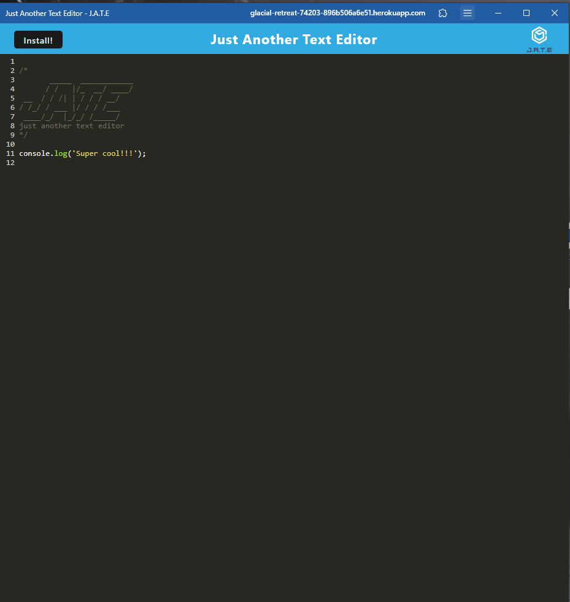

# Just Another Text Editor (J.A.T.E.)

## Description

This text editor was created to help developers code offline. As a developer, I want to create notes or code snippets with or without an internet connection. So that, I can reliably retrieve them for later use.

## Table Of Contents

- [Installation](#installation)
- [Usage](#usage)
- [License](#license)
- [How To Contribute](#how-to-contribute)
- [Tests](#tests)
- [Questions](#questions)

## Installation

Please visit https://glacial-retreat-74203-896b506a6e51.herokuapp.com/ and click on the install button and follow the prompt to install this text editor.

## Usage

To use this text editor, please visit https://glacial-retreat-74203-896b506a6e51.herokuapp.com/ .  If the app is already installed, please navigate to the app file directory and open up the app.  Enjoy!

## License

License Link: https://opensource.org/licenses/MIT

## How To Contribute

Please click [here](github.com/fzhao888/Text-Editor) to contribute 

## Tests

N/A

## Questions

If you have any questions, please here is my contact info:

GitHub: [fzhao888](https://github.com/fzhao888)

Email: frank.zhao93@gmail.com
